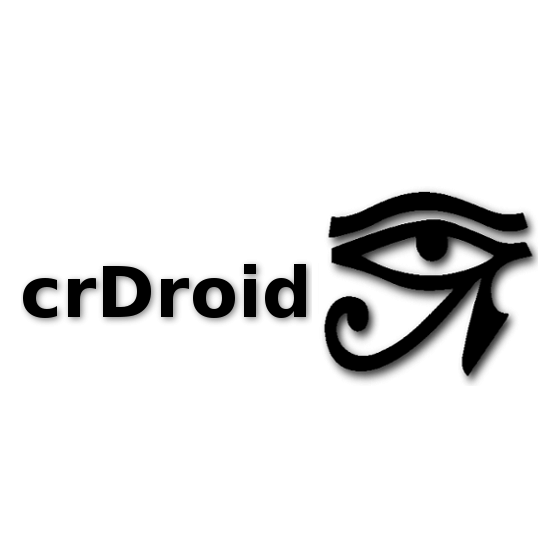
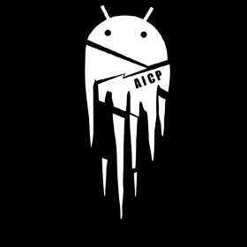
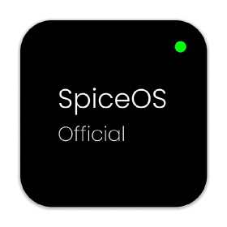
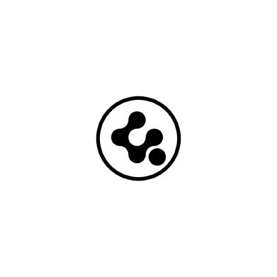
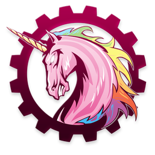
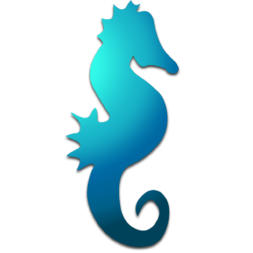
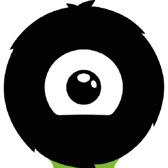
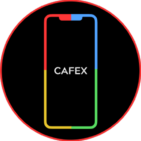

# A list of AOSP - ROMS

| AOSP - Roms           |      LOGOS                                            |Repos                                                                                           | Android Version |
| --------------------- | ----------------------------------------------------- | ---------------------------------------------------------------------------------------------- | --------------- |
| AOSP                  |                     | [google](https://android.googlesource.com/platform/manifest/) | 1.6 - 14        |
| Lineage OS            |                  | [GitHub](https://github.com/lineageos)                        | 2.2 - 13 *     |
| crDroid               |                  | [GitHub](https://github.com/crdroidandroid)                   | 4.4.4 - 13      |
| Pixel Experience      | </a>     | [GitHub](https://github.com/PixelExperience)                  | 8.1.0 - 13      |
| Pixel Experience Plus |          | [GitHub](https://github.com/PixelExperience)                  | 8.1.0 - 13      |
| Resurrection Remix    |                       | [GitHub](https://jeykul.github.io/its-dead/)                  | 4.2.2 - 10      |
| SparkOS               |                   | [GitHub](https://github.com/Spark-Rom)                        | 11 - 13         |
| Evolution X           |                     | [GitHub](https://github.com/Evolution-X)                      | 9 - 14          |
| Bootleggers           |             | [GitHub](https://github.com/BootleggersROM)                   | 8 - 13          |
| AOSPA                 |                   | [GitHub](https://github.com/AOSPA)                            | 4.4.4 - 13      |
| OmniROM               |                    | [GitHub](https://github.com/omnirom)                          | 6 - 13 *         | 
| AICP                  |                     | [GitHub](https://github.com/AICP)                             | 4.0.0 - 13      |
| Derpfest              |                 | [GitHub](https://github.com/DerpFest-AOSP)                    | 11 - 14         |
| Leaf                  |                     | [GitHub](https://github.com/LeafOS-Project)                   | 12 - 14         |
| RisingOS              |                   | [GitHub](https://github.com/RisingTechOSS)                    | 13              |
| Elixir                |                  | [GitHub](https://github.com/Project-Elixir)                   | 12 - 14         |
| PixelOS               |                   | [GitHub](https://github.com/PixelOS-AOSP)                     | 11 - 13         |
| carbonROM             |                  | [GitHub](https://github.com/CarbonROM)                        | 5.1.1 - 11      |
| AmogOS                |                  | [GitHub](https://github.com/AmogOS-Rom)                       | 13              |
| CalyxOS               |                 | [GitHub](https://github.com/CalyxOS)                          | 9 - 14          |
| lmoDroid              |                 | [GitHub](https://github.com/LMODroid)                         | 11 - 14         |
| POSP                  |                     | [GitHub](https://github.com/PotatoProject)                    | 8.1 - 13        |
| StatixOS              |                | [GitHub](https://github.com/StatixOS)                         | 8.1 - 13        |
| AwakenOS              |                  | [GitHub](https://github.com/Project-Awaken)                   | 11 - 13         |
| ProtonPlus            |               | [GitHub](https://github.com/protonplus-org)                   | 12 - 13         |
| TequilaOS             |                | [GitHub](https://github.com/TequilaOS)                        | 13 - 14         |
| Bananadroid           |              | [GitHub](https://github.com/Bananadroid)                      | 11 - 13         |
| GhostOS               |                    | [GitHub](https://jeykul.github.io/its-dead/)                  | 12              |
| StagOS                |                    | [GitHub](https://github.com/StagOS/)                          | 9 - 13          |
| PixelPlusUI           |             | [GitHub](https://github.com/PixelPlusUI)                      | 12.1 - 13       |
| PixysOS               |                  | [GitHub](https://github.com/PixysOS)                          | 8 - 13          |
| Cherish OS            |               | [GitHub](https://github.com/CherishOS)                        | 10 - 13         |
| SpiceOS               |                  | [GitHub](https://github.com/SpiceOS)                          | 12 - 13         |
| Project Xtended       |         | [GitHub](https://github.com/crdroidandroid)                   | 8.1 - 13        |
| AICP                     | a                                                                                   | [Github](https://github.com/AICP)                             | a               |
| AIM ROM                     | a                                                                                | [Github](https://github.com/AIMROM)                           | a               |
| AlphaDroid            |         | [Github](https://github.com/AlrightAndroid-Brokenlab)
| AmyROM                |         | [Github](https://github.com/amyROM)
| Ancient OS            |         | [Github](https://github.com/Ancient-Lab)
| AOKP                  |         | [Github](https://github.com/AOKP)
| AOSDP                 |         | [Github](https://github.com/AOSDP) 
| AOSiP                 |         | [Github](https://github.com/AOSiP)
| AOSP Extended         |         | [Github](https://github.com/AospExtended)
| Aquari OS             |         | [Github](https://github.com/AquariOS) 
| Arrow OS              |         | [Github](https://github.com/arrowos)
| BananaDroid           |         | [Github](https://github.com/bananadroid)||
| BeastROMs             |         | [Github](https://github.com/BeastRoms) |
| Benzo ROM             |         | [Github](https://github.com/BenzoRom) |
| Bianca Project        |         | [Github](https://github.com/BiancaProject)|
| Bliss ROMs            |         | [Github](https://github.com/BlissRoms)||
| Bootleggers ROM       |         | [Github](https://github.com/BootleggersROM)||
| BsdkOS                |         | [Github](https://github.com/bsdkOS)|
| CAF Extended          |         | [Github](https://github.com/CAF-Extended)|
| CalyxOS               |         | [Github](https://github.com/CalyxOS)||
| CandyRoms             |         | [Github](https://github.com/CandyRoms)||
| Carbon ROM            |         | [Github](https://github.com/CarbonROM)||
| CatalystOS            |         | [Github](https://github.com/catalyst-android)||
| Cesium OS             |         | [Github](https://github.com/CesiumOS-org)||
| Cherish OS            |         | [Github](https://github.com/CherishOS)|
| CipherOS              |         | [Github](https://github.com/CipherOS)||
| Citrus CAF            |         | [Github](https://github.com/Citrus-CAF) |
| Colt OS               |         | [Github](https://github.com/Colt-Enigma) |
| ConquerOS             |         | [Github](https://github.com/ConquerOS)|
| Corvus ROM            |         | [Github](https://github.com/Corvus-AOSP)||
| Cosmic OS             |         | [Github](https://github.com/Cosmic-OS)||
| CrDroid               |         | [Github](https://github.com/crdroidandroid)||
| Cygnus ROM            |         | [Github](https://github.com/cygnus-rom)|
| Cypher OS             |         | [Github](https://github.com/CypherOS)|
| Derpfest              |         | [Github](https://github.com/DerpLab)||
| Descendant X          |         | [Github](https://github.com/Descendant)||
| Dirty Unicorns        |         | [Github](https://github.com/DirtyUnicorns)||
| DivestOS              |         | [Github](https://github.com/divested-mobile)
| Dot OS                |         | [Github](https://github.com/DotOS)||
| DroidX-UI             |         | [Github](https://github.com/DroidX-UI)|
| eFoundation           |         | [Github](https://github.com/e-foundation)||
| ElytraOS              |         | [Github](https://github.com/elytraOS)|
| Eternity OS           |         | [Github](https://github.com/EternityOS-Plus-Tiramisu)|
| Evolution X           |         | [Github](https://github.com/Evolution-X)||
| ExTHmUI               |         | [Github](https://github.com/exthmui)||
| FireHound             |         | [Github](https://github.com/FireHound)||
| Flamingo OS           |         | [Github](https://github.com/Flamingo-OS)|
| Floko ROM             |         | [Github](https://github.com/FlokoROM)||
| Fluid OS              |         | [Github](https://github.com/project-fluid)||
| Fork LineageOS        |         | [Github](https://github.com/ForkLineageOS)|
| Freaky OS             |         | [Github](https://github.com/FreakyOS)||
| Fusion OS             |         | [Github](https://github.com/Fusion-OS)|
| GrapheneOS            |         | [Github](https://github.com/GrapheneOS)||
| Halogen OS            |         | [Github](https://github.com/halogenOS)||
| Havoc OS              |         | [Github](https://github.com/Havoc-OS)||
| HentaiOS              |         | [Github](https://github.com/hentaiOS)||
| HyconOS               |         | [Github](https://github.com/HyconOS)|
| Ion OS                |         | [Github](https://github.com/i-o-n) |
| IronOS Project        |         | [Github](https://github.com/IronOSProject)|
| Kang OS               |         | [Github](https://github.com/Kang-OS-R) |
| Komodo OS             |         | [Github](https://github.com/Komodo-OS)||
 | Krypton Open Source Project |         | [Github](https://github.com/AOSP-Krypton)|  <!-- An exeption for the table-->
| Legion OS             |         | [Github](https://github.com/Project-LegionOS)||
| LightningFastRom      |         | [Github](https://github.com/lightningfastrom)|
| Lineage OS            |         | [Github](https://github.com/LineageOS)||
| Liquid Remix          |         | [Github](https://github.com/LiquidRemix) |
| LLuvia OS             |         | [Github](https://github.com/LLuviaOS) |
| Magnus OS             |         | [Github](https://github.com/Magnus-OS)|
| Mallu OS              |         | [Github](https://github.com/MalluOS)||
| MoKee ROM             |         | [Github](https://github.com/MoKee)||
| MSM Xtended           |         | [Github](https://github.com/Project-Xtended)|
| Nethunter OS          |         | [Gitlab](https://gitlab.com/kalilinux/nethunter)||
| NightskyROM           |         | [Github](https://github.com/NightskyROM)|
| Nitrogen OS           |         | [Github](https://github.com/nitrogen-project)|
| Nusantara Project     |         | [Github](https://github.com/Nusantara-ROM)|
| Octavi OS             |         | [Github](https://github.com/Octavi-Staging)|
| Omni ROM              |         | [Github](https://github.com/omnirom)||
| PalladiumOS           |         | [Github](https://github.com/Palladium-OS)|
| Paranoid Android      |         | [Github](https://github.com/AOSPA)||
| Pixel Blaster OS      |         | [Github](https://github.com/PixelBlaster-OS)||
| Pixel Dust            |         | [Github](https://github.com/PixelDust-Project-X) |
| Pixel Experience      |         | [Github](https://github.com/PixelExperience)||
| PixelExtended ROM     |         | [Github](https://github.com/PixelExtended)||
| PixelPlusUI           |         | [Github](https://github.com/PixelPlusUI-Elle)||
| PixelOS               |         | [Github](https://github.com/PixelOS-AOSP)||
| Pixys OS              |         | [Github](https://github.com/PixysOS)||
| POSP                  |         | [Github](https://github.com/PotatoProject)||
| Project 404           |         | [Github](https://github.com/P-404)||
| Project Arcana        |         | [Github](https://github.com/projectarcana-aosp)||
| Project Awaken        |         | [Github](https://github.com/Project-Awaken)|
| Project Blaze         |         | [Github](https://github.com/ProjectBlaze)|
| Project Elixir        |         | [Github](https://github.com/Project-Elixir)||
| Project Kaleidoscope  |         | [Github](https://github.com/Project-Kaleidoscope)|
| Project Kasumi        |         | [Github](https://github.com/ProjectKasumi)|
| Project Lighthouse    |         | [Github](https://github.com/lighthouse-os)||
| Project Mushroom      |         | [Github](https://github.com/Project-Mushroom)|
| Project Radiant       |         | [Github](https://github.com/ProjectRadiant)|
| Project Sakura        |         | [Github](https://github.com/ProjectSakura)||
| Project Streak        |         | [Github](https://github.com/ProjectStreak)||
| Project Titanium      |         | [Github](https://github.com/Project-Titanium)|
| Proton AOSP           |         | [Github](https://github.com/ProtonAOSP)|
| ReloadedOS            |         | [Github](https://github.com/ReloadedOS)||
| Resurrection Remix OS |         | [Github](https://github.com/ResurrectionRemix)||
| ResurrectionRemix-Revived |     | [Github](https://github.com/ResurrectionRemix-Revived)|| <!-- An exeption for the table-->
| Revenge OS            |         | [Github](https://github.com/RevengeOS) |
| RiceDroid             |         | [Github](https://github.com/RiceDroidOSS)|
| RohieOS               |         | [Github](https://github.com/RohieOS)|
| Scorpion ROM          |         | [Github]( https://github.com/ScorpionRom)||
| ShapeShift OS         |         | [Github]( https://github.com/ShapeShiftOS)|
| SlimRoms              |         | [Github](https://github.com/slimroms)||
| SoniUI                |         | [Github](https://github.com/XOSP-Reborn)|
| SparkOS               |         | [Github](https://github.com/Spark-Rom)||
| Spice OS              |         | [Github](https://github.com/SpiceOS)|
| Stag OS               |         | [Github](https://github.com/StagOS)|
| StatiX OS             |         | [Github](https://github.com/StatiXOS)|
| Superior OS           |         | [Github](https://github.com/SuperiorOS)||
| Syberia OS            |         | [Github](https://github.com/syberia-project)||
| TenXOS                |         | [Github](https://github.com/TenX-OS)|
| Tequila OS            |         | [Github](https://github.com/tequilaOS)|
| The Kraken Project    |         | [Github](https://github.com/AOSPK)|
| The Styx Project      |         | [Github](https://github.com/StyxProject)||
| The XPerience Project |         | [Github](https://github.com/TheXPerienceProject)|
| Tipsy OS              |         | [Github](https://github.com/TipsyOs)|
| Toxyc OS              |         | [Github](https://github.com/ToxycOS)|
| Validus OS            |         | [Github](https://github.com/ValidusOs)|
| Viper OS              |         | [Github](https://github.com/ViperOS)||
| VoidUI                |         | [Github](https://github.com/VoidUI)|
| Voltage OS            |         | [Github](https://github.com/VoltageOS)|
| WaveOS                |         | [Github](https://github.com/Wave-Project)|
| Weeb Projekt          |         | [Github](https://github.com/weebproject)|
| Xdroid CAF            |         | [Github](https://github.com/xdroid-CAF)|
| Xdroid OS             |         | [Github](https://github.com/xdroid-oss)|
| Xenon HD              |         | [Github](https://github.com/TeamHorizon)||
| YAAP AOSP             |         | [Github]( https://github.com/yaap) |
| ZeusOS                |         | [Github](https://github.com/Zeus-OS)|

©  2023 SphericalKat for the nice list 