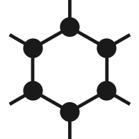
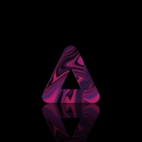
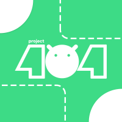
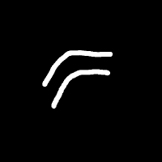
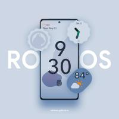
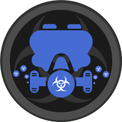
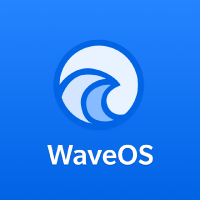
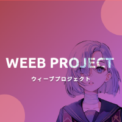

# A list of AOSP - ROMS

| AOSP - Roms                   |      LOGOS                                                                             |Repos                                                          | Android Version |EOL|
| ----------------------------- | -------------------------------------------------------------------------------------- | ------------------------------------------------------------- | --------------- |-- |
| AICP                          |                     | [GitHub](https://github.com/AICP)                             | 4.0.0 - 13      |
| AIM ROM                       |                   | [Github](https://github.com/AIMROM)                           | 7 - 10          | ✅|
| AlphaDroid                    |               | [Github](https://github.com/AlrightAndroid-Brokenlab)         | 10              | ✅|
| AmogOS                        |                  | [GitHub](https://github.com/AmogOS-Rom)                       | 12 - 13         |
| AmyROM                        |                   | [Github](https://github.com/amyROM)                           | 11 - 13         |
| Ancient OS                    |               | [Github](https://github.com/Ancient-Lab)                      | 10              | ✅|
| AOKP                          |                     | [Github](https://github.com/AOKP)                             | 6 - 9           | ✅|
| AOSDP                         |                    | [Github](https://github.com/AOSDP)                            | 8.1 - 9         | ✅|
| AOSiP                         |                    | [Github](https://github.com/AOSiP)                            | 8 - 11          | ✅|
| AOSPA                         |                   | [GitHub](https://github.com/AOSPA)                            | 4.4.4 - 13      |
| AOSP Extended                 |             | [Github](https://github.com/AospExtended)                     | 7 - 12.1        | ✅|
| AOSP                          |                     | [google](https://android.googlesource.com/platform/manifest/) | 1.6 - 14        |
| Aquari OS                     |                 | [Github](https://github.com/AquariOS)                         | 7.1.1 - 10      | ✅|
| Arrow OS                      |                  | [Github](https://github.com/arrowos)                          | 8 - 14          |
| AwakenOS                      |                  | [GitHub](https://github.com/Project-Awaken)                   | 11 - 13         |
| Bananadroid                   |              | [GitHub](https://github.com/Bananadroid)                      | 11 - 13         |
| BeastROMs                     |                | [Github](https://github.com/BeastRoms)                        | 9 - 10          | ✅|
| Benzo ROM                     |                    | [Github](https://github.com/BenzoRom)                         | 8 - 13          |
| Bianca Project                |            | [Github](https://github.com/BiancaProject)                    | 9 - 13          |
| Bliss ROMs                    |                 | [Github](https://github.com/BlissRoms)                        | 6 - 13          |
| Bootleggers ROM               |             | [Github](https://github.com/BootleggersROM)                   | 8 - 13          |
| BsdkOS                        |                    | [Github](https://github.com/bsdkOS)                           | 12              | ✅|
| CAF Extended                  |              | [Github](https://github.com/CAF-Extended)                     | 11 - 12         | ✅|
| CalyxOS                       |                 | [GitHub](https://github.com/CalyxOS)                          | 9 - 14          |
| CandyRoms                     |                | [Github](https://github.com/CandyRoms)                        | 10 - 14         |
| carbonROM                     |                  | [GitHub](https://github.com/CarbonROM)                        | 5.1.1 - 11      | ✅|
| CatalystOS                    |              | [Github](https://github.com/catalyst-android)                 | 13              |
| Cesium OS                     |                          | [Github](https://github.com/CesiumOS-org)                     | 11 - 13         |
| Cherish OS                    |               | [GitHub](https://github.com/CherishOS)                        | 10 - 13         |
| CipherOS                      |                   | [Github](https://github.com/CipherOS)                         | 12 - 14         |
| Citrus CAF                    |                   | [Github](https://github.com/Citrus-CAF)                       | 6 - 9           | ✅|
| Colt OS                       |                     | [Github](https://github.com/Colt-Enigma)                      | 9 - 13          |
| ConquerOS                     |                 | [Github](https://github.com/ConquerOS)                        | 10 - 13         |
| Corvus ROM                    |                   | [Github](https://github.com/Corvus-AOSP)                      | 13 - 13         |
| Cosmic OS                     |                   | [Github](https://github.com/Cosmic-OS)                        | 8 - 10          | ✅|
| crDroid                       |                  | [GitHub](https://github.com/crdroidandroid)                   | 4.4.4 - 13      |
| Cygnus ROM                    |                  | [Github](https://github.com/cygnus-rom)                       | 10 - 13         |
| Cypher OS                     |                   | [Github](https://github.com/CypherOS)                         | 7 - 10          | ✅|
| Derpfest                      |                 | [GitHub](https://github.com/DerpFest-AOSP)                    | 11 - 14         |
| Descendant X                  |               | [Github](https://github.com/Descendant)                       | 9               | ✅|
| Dirty Unicorns                |                   | [Github](https://github.com/DirtyUnicorns)                    | 4.4.4 - 12      | ✅|
| DivestOS                      |                     | [Github](https://github.com/divested-mobile)                  | 12 - 13         |
| Dot OS                        |                      | [Github](https://github.com/DotOS)                            | 7 - 12.1        | ✅|
| DroidX-UI                     |                  | [Github](https://github.com/DroidX-UI)                        | 13-14           |
| eFoundation                   |                  | [Github](https://github.com/e-foundation)                     | idk             |
| Elixir                        |                  | [GitHub](https://github.com/Project-Elixir)                   | 12 - 14         |
| ElytraOS                      |                  | [Github](https://github.com/elytraOS)                         | 12 - 13         |
| Eternity OS                   |                     | [Github](https://github.com/EternityOS-Plus-Tiramisu)         | 13              | ✅|
| Evolution X                   |                     | [GitHub](https://github.com/Evolution-X)                      | 9 - 14          |
| ExTHmUI                       |                    | [Github](https://github.com/exthmui)                          | 13 - 14         |
| FireHound                     |                     | [Github](https://github.com/FireHound)                        | 6 - 10          | ✅|
| Flamingo OS                   |                | [Github](https://github.com/Flamingo-OS)                      | 12.1 - 13       |
| Floko ROM                     |                    | [Github](https://github.com/FlokoROM)                         | 13              |
| Fluid OS                      |                    | [Github](https://github.com/project-fluid)                    | 10 - 12.1       | ✅|
| Fork LineageOS                |             | [Github](https://github.com/ForkLineageOS)                    | 10 - 13         |
| Freaky OS                     |                   | [Github](https://github.com/FreakyOS)                         | 10 - 11         | ✅|
| Fusion OS                     |                   | [Github](https://github.com/Fusion-OS)                        | 13 - 14         |
| GhostOS                       |                    | [GitHub](https://jeykul.github.io/its-dead/)                  | 12              |
| GrapheneOS                    |               | [Github](https://github.com/GrapheneOS)                       | 13 - 14         |
| Halogen OS                    |                  | [Github](https://github.com/halogenOS)                        | 6  - 14         |
| Havoc OS                      |                  | [Github](https://github.com/Havoc-OS)                         | 9  - 13         |
| HentaiOS                      |                   | [Github](https://github.com/hentaiOS)                         | 10 - 14         |
| HyconOS                       |                    | [Github](https://github.com/HyconOS)                          | a               | ✅|
| Ion OS                        |                      | [Github](https://github.com/i-o-n)                            | a               | ✅|
| IronOS Project                |                     | [Github](https://github.com/IronOSProject)                    | a               | ✅|
| Kang OS                       |                     | [Github](https://github.com/Kang-OS-R)                        | a               |
| Komodo OS                     |                   | [Github](https://github.com/Komodo-OS)                        | a               |
| Krypton Open Source Project   |                 | [Github](https://github.com/AOSP-Krypton)                     | a               |
| Leaf                          |                     | [GitHub](https://github.com/LeafOS-Project)                   | 12 - 14         |
| Legion OS                     |                  | [Github](https://github.com/Project-LegionOS)                 | a               |
| LightningFastRom              |                  | [Github](https://github.com/lightningfastrom)                 | a               |
| Lineage OS                    |                  | [GitHub](https://github.com/lineageos)                        | 2.2 - 13 *      |
| Liquid Remix                  |                   | [Github](https://github.com/LiquidRemix)                      | a               |
| LLuvia OS                     |                   | [Github](https://github.com/LLuviaOS)                         | a               |
| lmoDroid                      |                 | [GitHub](https://github.com/LMODroid)                         | 11 - 14         |
| Magnus OS                     |                   | [Github](https://github.com/Magnus-OS)                        | a               | ✅|
| Mallu OS                      |                   | [Github](https://github.com/MalluOS)                          | a               | ✅|
| MoKee ROM                     |                    | [Github](https://github.com/MoKee)                            | a               |
| MSM Xtended   #######         |         | [Github](https://github.com/Project-Xtended)                  | a               |
| Nitrogen OS                   |                   | [Github](https://github.com/nitrogen-project)                 | a               |
| Nusantara Project             |               | [Github](https://github.com/Nusantara-ROM)                    | a               |
| Octavi OS                     |                 | [Github](https://github.com/Octavi-Staging)                   | a               |
| OmniROM                       |                    | [GitHub](https://github.com/omnirom)                          | 6 - 13 *        | 
| PalladiumOS                   |               | [Github](https://github.com/Palladium-OS)                     | a               |
| Paranoid Android              |                   | [Github](https://github.com/AOSPA)                            | a               |
| Pixel Blaster OS              |                 | [Github](https://github.com/PixelBlaster-OS)                  | a               |
| Pixel Dust                    |                     | [Github](https://github.com/PixelDust-Project-X)              | a               |
| Pixel Experience              | </a>     | [GitHub](https://github.com/PixelExperience)                  | 8.1.0 - 13      |
| Pixel Experience Plus         |          | [GitHub](https://github.com/PixelExperience)                  | 8.1.0 - 13      |
| PixelExtended ROM             |                      | [Github](https://github.com/PixelExtended)                    | a               |
| PixelOS                       |                   | [GitHub](https://github.com/PixelOS-AOSP)                     | 11 - 13         |
| PixelPlusUI                   |             | [GitHub](https://github.com/PixelPlusUI)                      | 12.1 - 13       |
| PixysOS                       |                  | [GitHub](https://github.com/PixysOS)                          | 8 - 13          |
| Pixys OS                      |         | [Github](https://github.com/PixysOS)                          | a               |
| POSP                          |                     | [GitHub](https://github.com/PotatoProject)                    | 8.1 - 13        |
| Project 404                   |                      | [Github](https://github.com/P-404)                            | a               |
| Project Arcana    [EOL]       |                   | [Github](https://github.com/projectarcana-aosp)               | a               | ✅|
| Project Blaze                 |                    | [Github](https://github.com/ProjectBlaze)                     | a               |
| Project Kaleidoscope          |                    | [Github](https://github.com/Project-Kaleidoscope)             | a               |
| Project Kasumi                |                  | [Github](https://github.com/ProjectKasumi)                    | a               |
| Project Lighthouse            |               | [Github](https://github.com/lighthouse-os)                    | a               |
| Project Mushroom  [EOL]       |                 | [Github](https://github.com/Project-Mushroom)                 | a               | ✅|
| Project Radiant               |                 | [Github](https://github.com/ProjectRadiant)                   | a               |
| Project Sakura                |                  | [Github](https://github.com/ProjectSakura)                    | a               |
| Project Streak                |                   | [Github](https://github.com/ProjectStreak)                    | a               |
| Project Titanium   [EOL]      |                 | [Github](https://github.com/Project-Titanium)                 | a               | ✅|
| Project Xtended  #######      |                             | [GitHub](https://github.com/crdroidandroid)                   | 8.1 - 13        |
| Proton AOSP                   |               | [Github](https://github.com/ProtonAOSP)                       | a               |
| ProtonPlus                    |               | [GitHub](https://github.com/protonplus-org)                   | 12 - 13         |
| ReloadedOS                    |                 | [Github](https://github.com/ReloadedOS)                       | a               |
| Resurrection Remix            |                       | [GitHub](https://jeykul.github.io/its-dead/)                  | 4.2.2 - 10      | ✅|
| ResurrectionRemix-Revived     |                     | [Github](https://github.com/ResurrectionRemix-Revived)        | a               |
| Revenge OS                    |                  | [Github](https://github.com/RevengeOS)                        | a               |
| RiceDroid                     |                     | [Github](https://github.com/RiceDroidOSS)                     | a               |
| RisingOS                      |                   | [GitHub](https://github.com/RisingTechOSS)                    | 13              |
| RohieOS                       |                   | [Github](https://github.com/RohieOS)                          | a               |
| Scorpion ROM                  |                | [Github](https://github.com/ScorpionRom)                      | a               |
| ShapeShift OS                 |              | [Github](https://github.com/ShapeShiftOS)                     | a               |
| SlimRoms                      |                  | [Github](https://github.com/slimroms)                         | a               |
| SoniUI                        |                    | [Github](https://github.com/XOSP-Reborn)                      | a               |
| SparkOS                       |                   | [GitHub](https://github.com/Spark-Rom)                        | 11 - 13         |
| SpiceOS                       |                  | [GitHub](https://github.com/SpiceOS)                          | 12 - 13         |
| StagOS                        |                    | [GitHub](https://github.com/StagOS/)                          | 9 - 13          |
| StatixOS                      |                | [GitHub](https://github.com/StatixOS)                         | 8.1 - 13        |
| Superior OS                   |                 | [Github](https://github.com/SuperiorOS)                       | a               |
| Syberia OS                    |                  | [Github](https://github.com/syberia-project)                  | a               |
| TenXOS                        |                      | [Github](https://github.com/TenX-OS)                          | a               |
| TequilaOS                     |                | [GitHub](https://github.com/TequilaOS)                        | 13 - 14         |
| The Kraken Project            |                  | [Github](https://github.com/AOSPK)                            | a               |
| The Styx Project              |                     | [Github](https://github.com/StyxProject)                      | a               |
| The XPerience Project         |                       | [Github](https://github.com/TheXPerienceProject)              | a               |
| Tipsy OS                      |                    | [Github](https://github.com/TipsyOs)                          | a               |
| Toxyc OS                      |                    | [Github](https://github.com/ToxycOS)                          | a               |
| Validus OS                    |                 | [Github](https://github.com/ValidusOs)                        | a               |
| Viper OS                      |                    | [Github](https://github.com/ViperOS)                          | a               |
| VoidUI     [EOL]              |                    | [Github](https://github.com/VoidUI)                           | a               | ✅|
| Voltage OS                    |                     | [Github](https://github.com/VoltageOS)                        | a               |
| WaveOS                        |                     | [Github](https://github.com/Wave-Project)                     | a               |
| Weeb Projekt                  |                     | [Github](https://github.com/weebproject)                      | a               |
| Xdroid CAF                    |                      | [Github](https://github.com/xdroid-CAF)                       | a               |
| Xdroid OS                     |                      | [Github](https://github.com/xdroid-oss)                       | a               |
| Xenon HD                      |                    | [Github](https://github.com/TeamHorizon)                      | a               |
| YAAP AOSP                     |                     | [Github](https://github.com/yaap)                             | a               |
| ZeusOS                        |                    | [Github](https://github.com/Zeus-OS)                          | a               |

©  2023 SphericalKat for the nice list 
All rights reserved