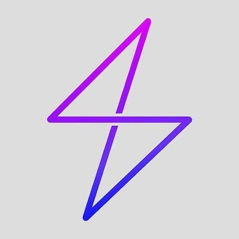

# A list of AOSP - ROMS

| AOSP - Roms   |      LOGOS                                             |   Repos                                    | Android Version |
| ------------- | ----------------------------------------------------- | ----------------------------------------- | --------------- |
| AOSP          |              | [aosp](https://android.googlesource.com/platform/manifest/) | 1.6 - 13        |
| Lineage OS    |           | [lineageos](https://github.com/lineageos)    | 2.2 - 13        |
| crDroid       |           | [crDroid](https://github.com/crdroidandroid)  | 4.4.4 - 13     |
| Pixel Experience |  | a                                           | a               |
| Pixel Experience Plus |  | a                                           | a               |
| Resurrection Remix |                | a                                           | a               |
| SparkOS       |             | a                                           | a               |
| Evolution X   |              | a                                           | a               |
| Bootleggers   |      | a                                           | a               |
| AOSPA         |            | a                                           | a               |
| OmniROM       |             | a                                           | a               |
| AICP          |              | a                                           | a               |
| Derpfest      |          | a                                           | a               |
| Leaf          |              | a                                           | a               |
| RisingOS      |            | a                                           | a               |
| Elixir        |           | a                                           | a               |
| PixelOS       |            | a                                           | a               |
| carbonROM     |           | a                                           | a               |
| AmogOS        |           | a                                           | a               |
| CalyxOS       |          | a                                           | a               |
| lmoDroid      |          | a                                           | a               |
| POSP          |              | a                                           | a               |
| StatixOS      |         | a                                           | a               |
| AwakenOS      |           | a                                           | a               |
| ProtonPlus    |                | a                                           | a               |
| TequilaOS     |                | a                                           | a               |
| Bananadroid   |                | a                                           | a               |
| GhostOS       |                | a                                           | a               |
| StagOS        |                | a                                           | a               |
| PixelPlusUI   |                | a                                           | a               |
| PixysOS       |                | a                                           | a               |
| Cherish OS    |                | a                                           | a               |
| SpiceOS       |                | a                                           | a               |
| Project Xtended |               | a                                           | a               |
| a             | a                                                   | a                                           | a               |
| a             | a                                                   | a                                           | a               |
