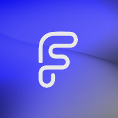
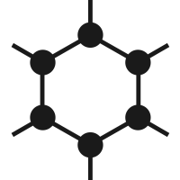

# A list of AOSP - ROMS

#### [home](https://github.com/JeyKul/aosp-roms/blob/main/readme.md) 
#### [back](https://github.com/JeyKul/aosp-roms/blob/main/sort.md) 

| AOSP - Roms                   |      LOGOS                                                                             |Repos                                                          | Android Version |EOL|
| ----------------------------- | -------------------------------------------------------------------------------------- | ------------------------------------------------------------- | --------------- |-- |
| AOSP                          |                     | [google](https://android.googlesource.com/platform/manifest/) | 1.6 - 14        |
| Arrow OS                      |                  | [Github](https://github.com/arrowos)                          | 8 - 14          |
| CalyxOS                       |                 | [GitHub](https://github.com/CalyxOS)                          | 9 - 14          |
| CandyRoms                     |                | [Github](https://github.com/CandyRoms)                        | 10 - 14         || CipherOS                      |                   | [Github](https://github.com/CipherOS)                         | 12 - 14         |
| Derpfest                      |                 | [GitHub](https://github.com/DerpFest-AOSP)                    | 11 - 14         |
| DroidX-UI                     |                  | [Github](https://github.com/DroidX-UI)                        | 13-14           |
| Elixir                        |                  | [GitHub](https://github.com/Project-Elixir)                   | 12 - 14         |
| Evolution X                   |                     | [GitHub](https://github.com/Evolution-X)                      | 9 - 14          |
| ExTHmUI                       |                    | [Github](https://github.com/exthmui)                          | 13 - 14         |
| Fusion OS                     |                   | [Github](https://github.com/Fusion-OS)                        | 13 - 14         |
| GrapheneOS                    |               | [Github](https://github.com/GrapheneOS)                       | 13 - 14         |
| Halogen OS                    |                  | [Github](https://github.com/halogenOS)                        | 6  - 14         |
| HentaiOS                      |                   | [Github](https://github.com/hentaiOS)                         | 10 - 14         |
| Leaf                          |                     | [GitHub](https://github.com/LeafOS-Project)                   | 12 - 14         |
| Lineage OS                    |                  | [GitHub](https://github.com/lineageos)                        | 2.2 - 14        |
| lmoDroid                      |                 | [GitHub](https://github.com/LMODroid)                         | 11 - 14         |
| Nitrogen OS                   |                   | [Github](https://github.com/nitrogen-project)                 | 7 - 14          |
| Octavi OS                     |                 | [Github](https://github.com/Octavi-Staging)                   | 13 - 14         |
| Pixel Experience              | </a>     | [GitHub](https://github.com/PixelExperience)                  | 8.1.0 - 14      |
| Pixel Experience Plus         |          | [GitHub](https://github.com/PixelExperience)                  | 8.1.0 - 14      |
| PixelExtended ROM             |                      | [Github](https://github.com/PixelExtended)                    | 11 - 14         |
| Project 404                   |                      | [Github](https://github.com/P-404)                            | 11 - 14         |
| Superior OS                   |                 | [Github](https://github.com/SuperiorOS)                       | 9 - 14          |
| TequilaOS                     |                | [GitHub](https://github.com/TequilaOS)                        | 13 - 14         |
| The XPerience Project         |                       | [Github](https://github.com/TheXPerienceProject)              | ?? - 14         |
| Voltage OS                    |                     | [Github](https://github.com/VoltageOS)                        | 11 - 14         |
| Xdroid OS                     |                      | [Github](https://github.com/xdroid-oss)                       | 12 - 14         |
| YAAP AOSP                     |                     | [Github](https://github.com/yaap)                             | 11 - 14         |
| ZeusOS                        |                    | [Github](https://github.com/Zeus-OS)                          | 10 - 14         |
